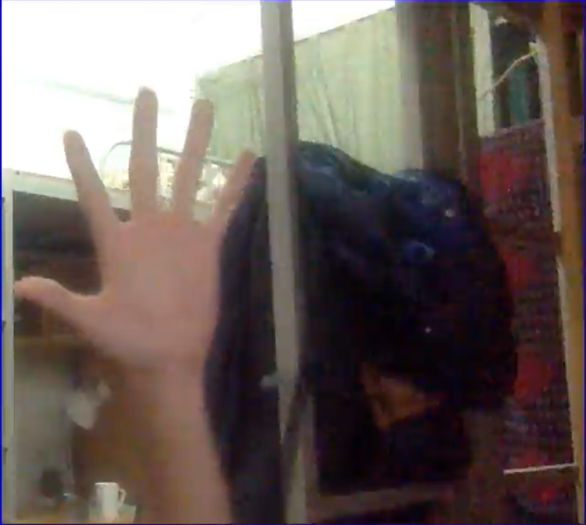
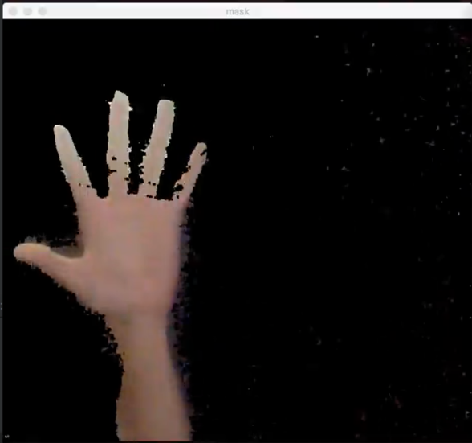
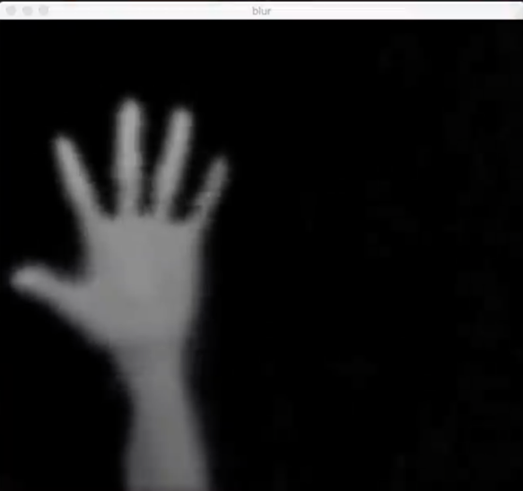
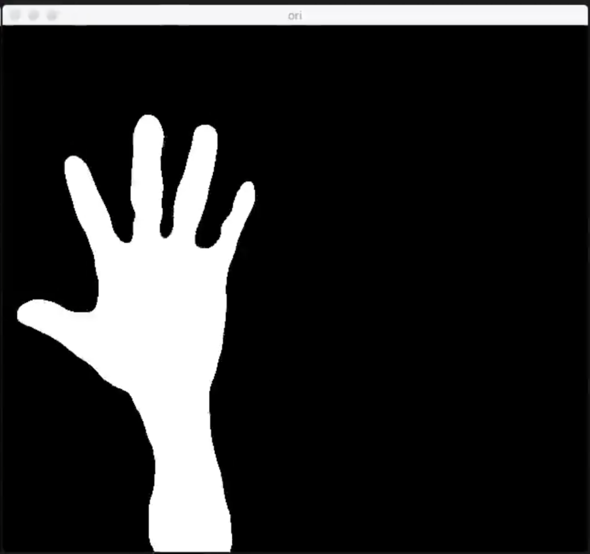
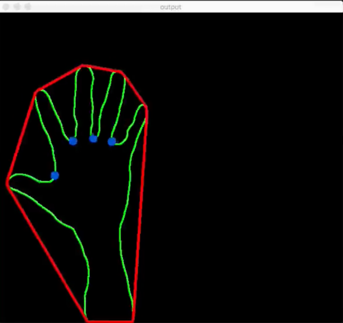
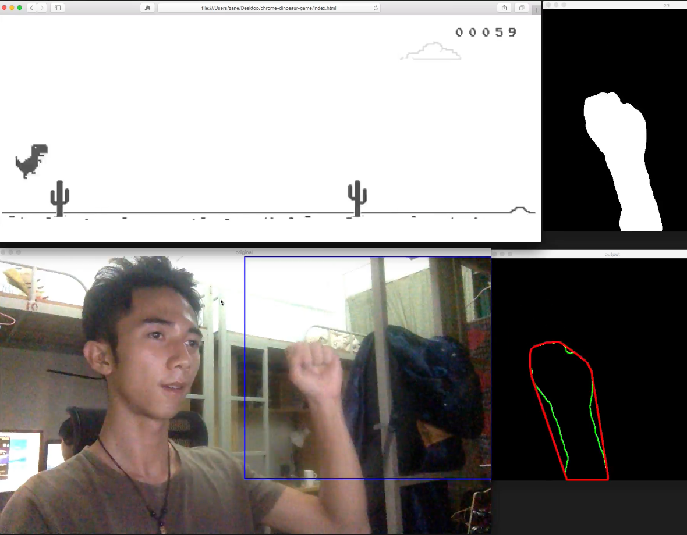

## Environment
- OS: MacOS El Capitan
- Platform: Python 2.7.12
- Librarys: 
	- OpenCV 2.4.13
	- appscript


## Demo Videos
- Youtube: [Click here](https://youtu.be/CmBxUnp7XwM)
- Youku: [Click here](http://v.youku.com/v_show/id_XMTc3MjI4MjQwOA==.html)

## How to run it?
- run it in python
- press `'b'` to capture the background model (Remember to move your hand out of the blue rectangle)
- press `'r'` to reset the backgroud model
- press `'ESC'` to exit

## Process
#### Capture original image

Capture video from camera and pick up a frame.



#### Capture background model & Background subtraction
Use background subtraction method called **Gaussian Mixture-based Background/Foreground Segmentation Algorithm** to subtract background. 

For more information about the method, check [Zivkovic2004](http://www.zoranz.net/Publications/zivkovic2004ICPR.pdf)

Here I use the OpenCV's built-in function `BackgroundSubtractorMOG2` to subtract background.

```python
bgModel = cv2.BackgroundSubtractorMOG2(0, bgSubThreshold)
```

Build a background subtractor model


```python
fgmask = bgModel.apply(frame)
```
Apply the model to a frame


```python
res = cv2.bitwise_and(frame, frame, mask=fgmask)
```

Get the foreground(hand) image



#### Gaussian blur & Threshold
```python
gray = cv2.cvtColor(img, cv2.COLOR_BGR2GRAY)
```
First convert the image to gray scale.

```python
blur = cv2.GaussianBlur(gray, (blurValue, blurValue), 0)
```
By Gaussian blurring, we create smooth transition from one color to another and reduce the edge content.



```python
ret, thresh = cv2.threshold(blur, threshold, 255, cv2.THRESH_BINARY)
```
We use thresholding to create binary images from grayscale images. 




#### Contour & Hull & Convexity 
We now need to find out the hand contour from the binary image we created before and detect fingers (or in other words, recognize gestures)

```python
contours, hierarchy = cv2.findContours(thresh1, cv2.RETR_TREE, cv2.CHAIN_APPROX_SIMPLE)
```
This function will find all the contours from the binary image. We need to get the biggest contours (our hand) based on their area since we can assume that our hand will be the biggest contour in this situation. (it's obvious)

After picking up our hand, we can create its hull and detect the defects by calling :
```python
hull = cv2.convexHull(res)
defects = cv2.convexityDefects(res, hull)
```




Now we have the number of fingers. How to use this information? It's based on your imagination...

I add in a keyboard simulation package named **appscript** as interface to control Chrome's dinosaur game.



----------------------
## References & Tutorials

1. OpenCV documentation: 
http://docs.opencv.org/2.4.13/
2. Opencv python hand gesture recognition:
http://creat-tabu.blogspot.com/2013/08/opencv-python-hand-gesture-recognition.html
3. Mahaveerverma's hand gesture recognition project:
[hand-gesture-recognition-opencv](https://github.com/mahaveerverma/hand-gesture-recognition-opencv)

